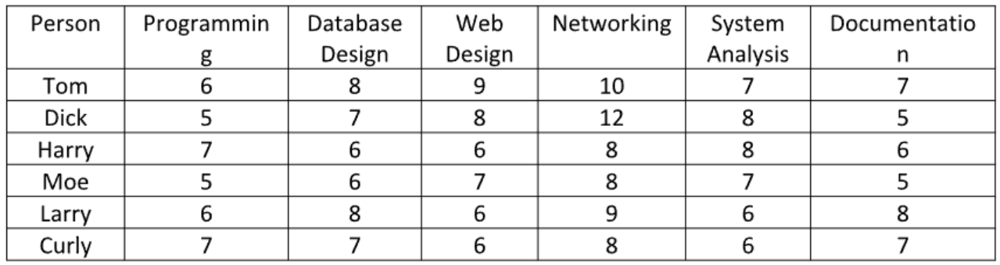
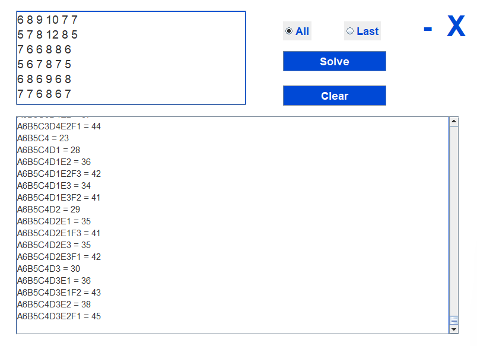
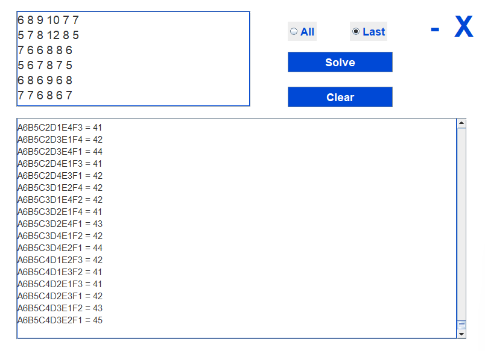

# Assignment-Problem-Backtracking

## Input Requirements

### Given
- 6 by 6 integer

### Type of Output
- radiobutton "All" to output all combinations
- radiobutton "Last" to output all combinations with the 6 letters

### Example Given to Input

